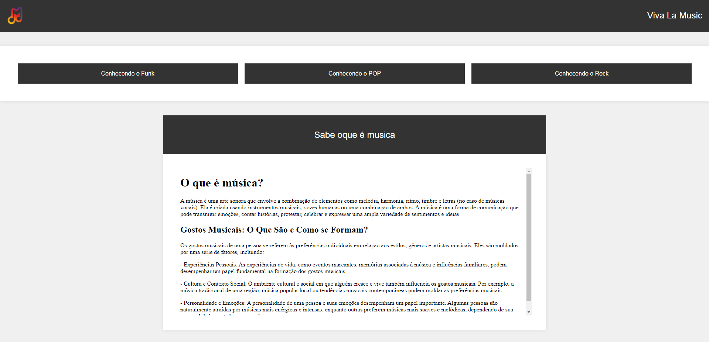

# Projeto Viva La Music

Este é um projeto web chamado "Viva La Music", um site informativo sobre diferentes gêneros musicais, incluindo Funk, Pop e Rock. O site oferece informações sobre cada gênero, suas características, história e influência cultural.



## Conteúdo

- [Visão Geral](#visão-geral)
- [Recursos](#recursos)
- [Instruções de Uso](#instruções-de-uso)
- [Contribuição](#contribuição)
- [Licença](#licença)

## Visão Geral

Este projeto foi desenvolvido como parte de um estudo sobre programação web e design de interfaces. Ele é um exemplo de um site informativo que utiliza HTML, CSS e outras tecnologias web para criar uma experiência de usuário atraente.

## Recursos

- HTML5 e CSS3
- Páginas informativas sobre Funk, Pop e Rock
- Layout responsivo
- Links de navegação
- Conteúdo de demonstração sobre os gêneros musicais

## Instruções de Uso

1. Clone este repositório em sua máquina local usando `git clone`.

```bash
git chttps://github.com/Matheuskauanpinto/Viva-La-Music.git
